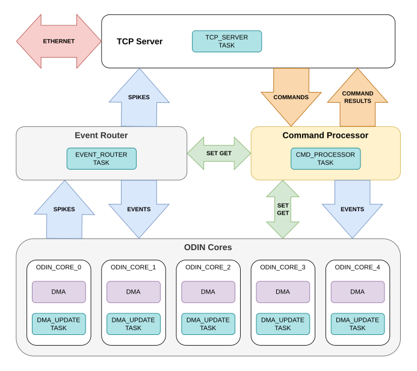
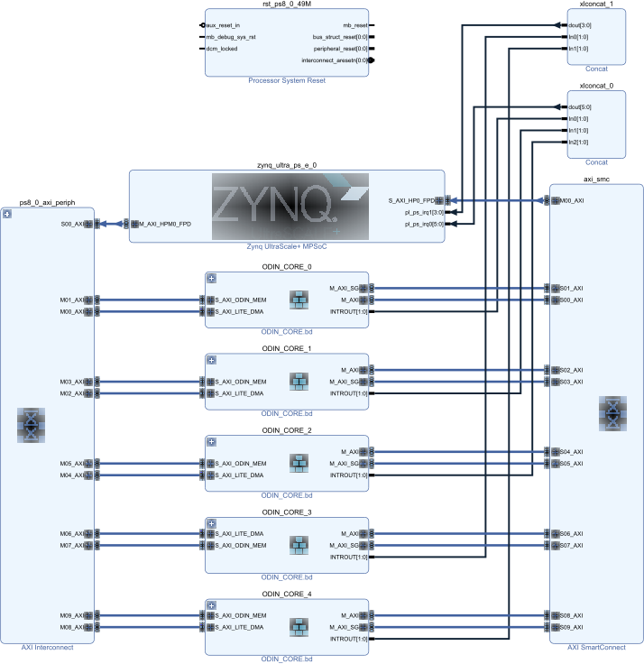
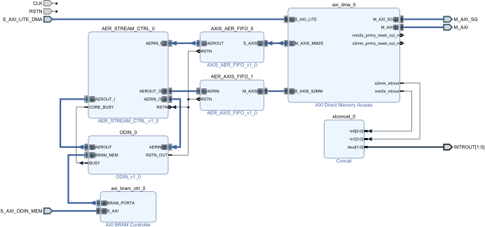
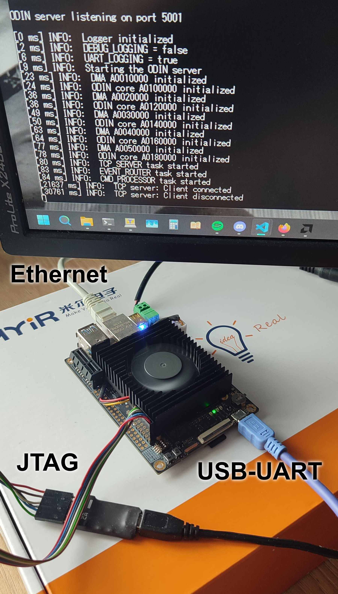

# Multicore SNN Accelerator

FPGA-based multicore spiking neural network accelerator using ODIN neuromorphic cores on Zynq UltraScale+.

ODIN: https://github.com/ChFrenkel/ODIN

This project was developed as an undergraduate engineering thesis in computer science (Bachelor's degree project)
and received a grade of 5.0.

## What Is In This Repo

- `pl/` FPGA design (Vivado projects, IP, RTL)
- `ps/` ARM server software (FreeRTOS + lwIP)
- `py/` Python training scripts and server client
- `fbs/` FlatBuffers communication schema

## Images

PS software schematic

	

5 cores implemented on FPGA connected to ARM processor

	

ODIN_CORE IP block diagram

	

Project running on MYIR FZ3 board

	

